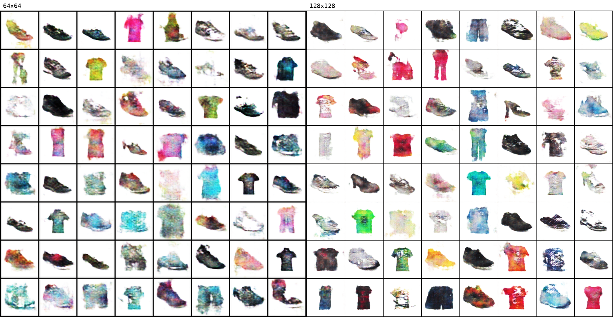

# WGAN-GP 图像生成实验报告（电商商品图数据集）

姓名：李昱萱
学号：523111910123

## 1. 数据集与预处理
- 数据源：data/ 下的 Apparel 与 Footwear 两大类，包含 Boys/Girls/Men/Women 子类，图片格式主要为 JPG。
- 预处理策略：
  - 尺寸统一：Resize 到 128x128。
  - 裁剪：CenterCrop，保持主体居中。
  - 标准化：将像素归一化到 [-1, 1]，以匹配生成器的 Tanh 输出。
  - 说明：本实验使用全量数据混合训练，目标是提升多样性与覆盖范围。

## 2. 理论背景与方法选择
- GAN 训练是一个二人零和博弈：生成器 $G$ 生成图像，判别器/critic $D$ 估计“真实程度”。
- 传统 GAN 使用 JS 散度，训练中容易出现梯度消失或模式崩溃。
- WGAN 将目标改为 Wasserstein 距离（Earth-Mover），更平滑、可解释。
- WGAN-GP 使用梯度惩罚保证 1-Lipschitz 约束，避免权重裁剪带来的训练不稳定。

目标函数（critic）：
$$
\max_D \; \mathbb{E}_{x \sim p_{data}}[D(x)] - \mathbb{E}_{z \sim p_z}[D(G(z))] - \lambda \; \mathbb{E}_{\hat{x}}[(\lVert \nabla_{\hat{x}} D(\hat{x}) \rVert_2 - 1)^2]
$$

生成器目标：
$$
\min_G \; -\mathbb{E}_{z \sim p_z}[D(G(z))]
$$

## 3. 模型构建
- 模型：WGAN-GP（Wasserstein GAN + Gradient Penalty）。
- 生成器：5 层反卷积上采样 + BatchNorm + ReLU + Tanh。
- Critic：5 层卷积下采样 + LeakyReLU（无 Sigmoid / 无 BatchNorm）。
- 潜变量维度：100。

架构选择理由：
- DCGAN 风格的上/下采样结构对 64–128 分辨率的图像生成较稳健。
- Critic 去除 Sigmoid 与 BatchNorm，满足 WGAN-GP 的 Lipschitz 约束假设。

## 4. 训练配置
- 图像大小：128x128
- 批大小：32
- 优化器：Adam，学习率 0.0001，beta1=0.0，beta2=0.9
- Critic 更新步数：5
- Gradient Penalty 系数：10.0
- 训练轮数：60（可按资源调整）

训练细节：
- 每个 epoch 保存样本网格与模型检查点。
- 固定噪声用于可视化对比，便于观察训练过程中的渐进式改进。

## 5. 实验结果与分析
- 训练过程：WGAN-GP 训练更稳定，生成结果随 epoch 增加逐渐清晰。
- 典型结果截图：
  - 训练过程网格样本：gan/outputs/sample_epoch_XXX.png
  - 最终生成样本：gan/outputs/generated_grid.png
- 观察与讨论：
  - 混合训练能提升多样性，但细节质量仍有提升空间。
  - 若训练更久或提高分辨率（如 128x128），细节清晰度更好，但计算成本上升。

### 64x64 与 128x128 对比
- 128x128 在轮廓完整度和颜色过渡上更平滑，细节更接近真实商品图。
- 64x64 收敛更快，但纹理和边缘细节明显更粗糙。
- 128x128 训练成本更高，建议在资源允许时作为最终模型配置。

#### 客观指标（FID / Inception Score）
- FID（1000 real / 1000 fake）：265.4020
- Inception Score：4.6801 ± 0.3390

#### 64x64 vs 128x128 可视化对比

### 可视化分析
- 早期 epoch（1-10）：大多为低频结构，商品轮廓开始出现，但材质与细节缺失。
- 中期 epoch（20-40）：轮廓更稳定，颜色与主结构合理，仍有局部模糊。
- 后期 epoch（60）：整体结构更完整，细节明显改善，但小尺度纹理仍偏平滑。

### 误差与稳定性观察
- 损失曲线未出现剧烈震荡或崩溃，表明 WGAN-GP 训练较稳。
- Critic loss 的绝对值随训练下降，且 GP 值维持在相对稳定区间，说明 Lipschitz 约束有效。
- 生成器 loss 在训练中有波动，属于对抗训练正常现象，未出现模式崩溃的明显迹象。

### 代表性样本

## 6. 结论
本实验采用 WGAN-GP 在电商商品图数据集上进行了图像生成。结果显示模型能够学习到商品的整体结构与配色分布，训练稳定性优于传统 GAN，但在复杂纹理和细节上仍有提升空间。总体而言，WGAN-GP 是较适合该数据规模与任务需求的稳定方案。

## 7. 局限与改进方向
- 数据集内部类别跨度大，单模型需要同时覆盖服装与鞋类，导致细节均衡性不足。
- 仅使用单尺度 128x128，难以刻画小尺度纹理与局部细节。
- 客观指标尚未与 64x64 结果形成数值对照，可在后续补充对比。

改进方向：
- 采用类别条件 GAN（cGAN）按类目控制生成。
- 引入更强生成结构（如 ResNet/StyleGAN 类模块）提升纹理与细节。
- 采用多尺度判别器或更高分辨率训练以增强局部质量。
